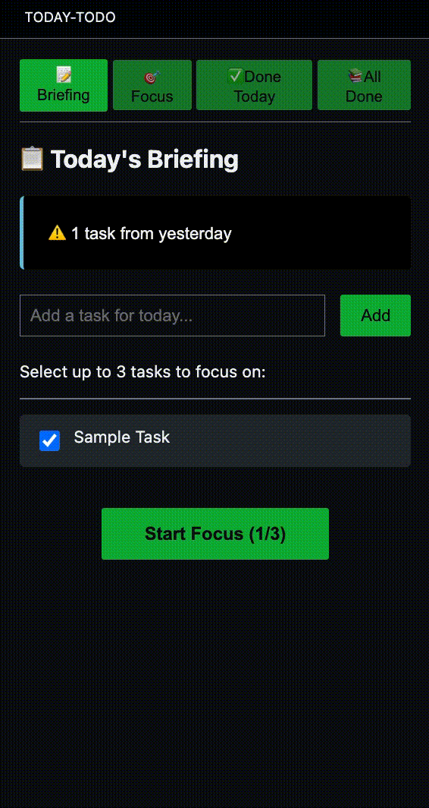
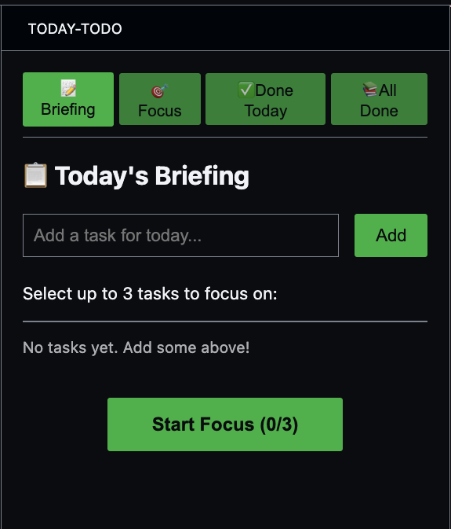
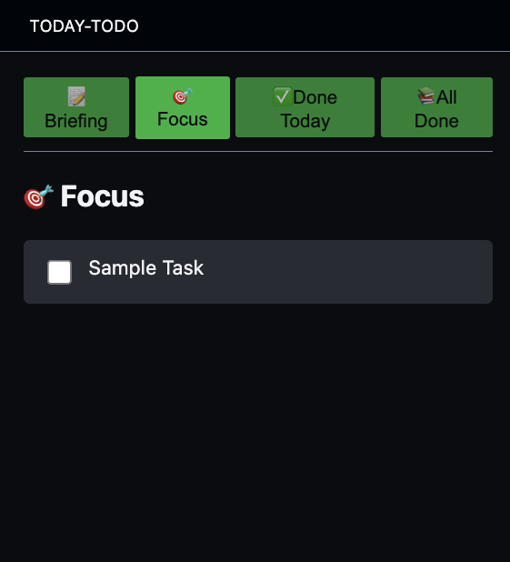
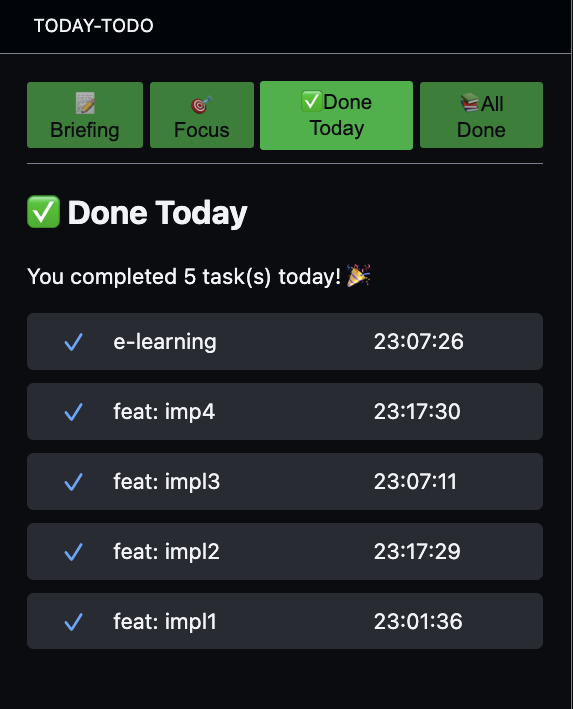
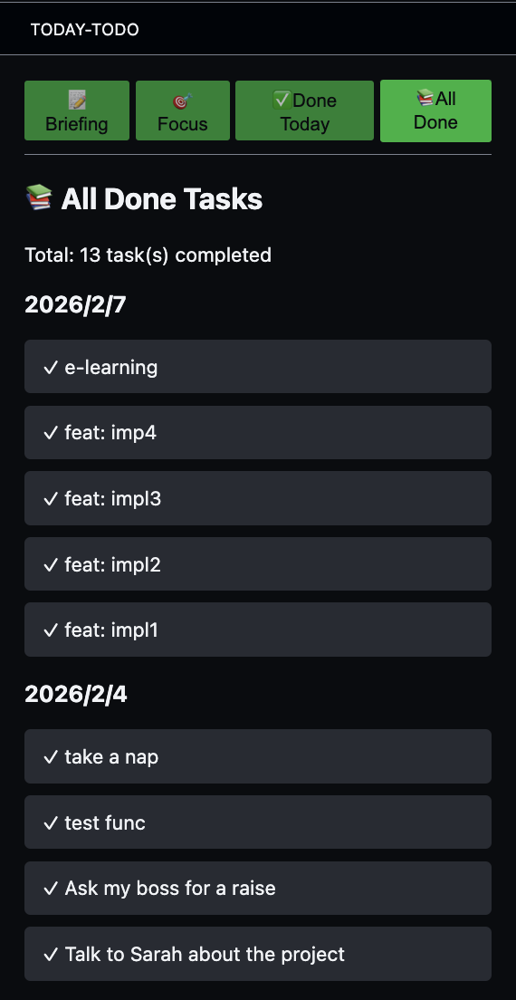

# Today ToDo! (VS Code Extension)

Today ToDo is a minimal, distraction-free daily task manager **extension for Visual Studio Code**.
Focus on what matters today, carry over unfinished tasks, and keep your workflow simple.

## Concept

These days, we often find ourselves juggling multiple tasks at once.
In such an environment, it’s easy to lose focus on what truly matters and forget important things.
Today ToDo helps you regain focus by encouraging you to clarify your priorities each day.

**How to Use:**
1. In the morning, write down all the tasks you want to accomplish today.
2. Choose up to 3 tasks to focus on right now.
3. As you complete each task, check it off.

This simple workflow helps you stay focused and productive, one day at a time.

## Features
- 📋 Briefing: Add today's tasks and select up to 3 to focus on
- ⚠️ Yesterday's incomplete tasks: Carry over unfinished tasks with one click
- 🎯 Focus Mode: Check off tasks as you complete them
- ✅ Done Today / Done All: Review your completed tasks by day or all-time
- 🌓 Theme-aware: Seamlessly matches your VS Code theme

## Demonstration
### Pages
1. **Briefing**  

1. **Focusing**  

1. **Check today done**  

1. **Check all done**  

### Sample

## Getting Started
1. Install the extension from the [VS Code Marketplace](https://marketplace.visualstudio.com/items?itemName=k2-gc.today-todo) or your VS Code directory.
2. Open the command palette and type `Today-ToDo: Open`.
3. Open the **Today ToDo** view from the Activity Bar.
4. Add your tasks for today and start focusing!

### Keep the icon in the Activity Bar

By default, VS Code may hide the Today-ToDo icon from the Activity Bar when you switch to another view.
If you want the icon to always stay visible:
1. Right-click the **Today-ToDo** icon in the Activity Bar.
2. Click **“Keep in Sidebar”** (or **“Pin”**).

## Known Issues
None at the moment. Please report issues on [GitHub](https://github.com/k2-gc/today-todo/issues).

## Release Notes
See [CHANGELOG.md](./CHANGELOG.md) for detailed release notes.

## License
This extension is licensed under the MIT License

